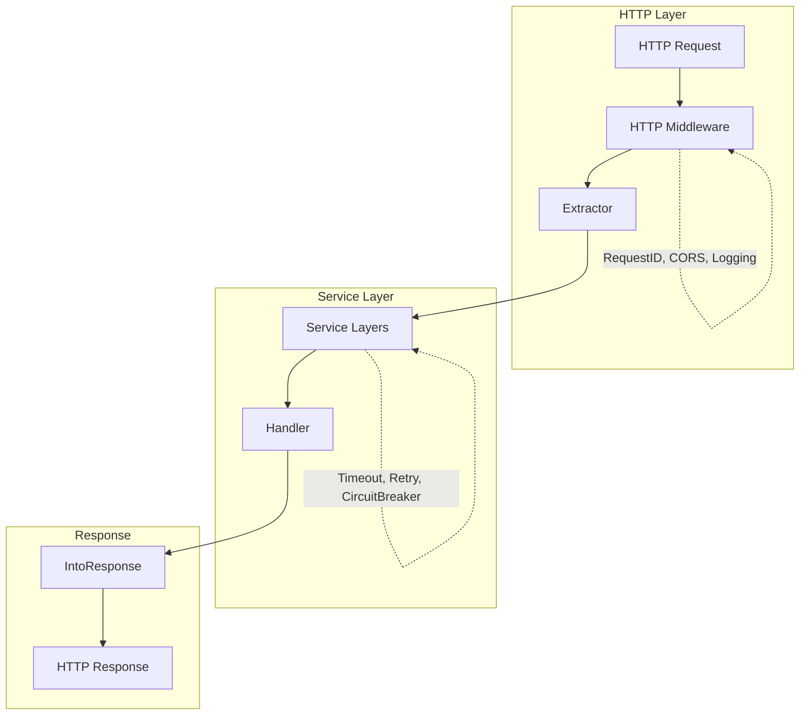
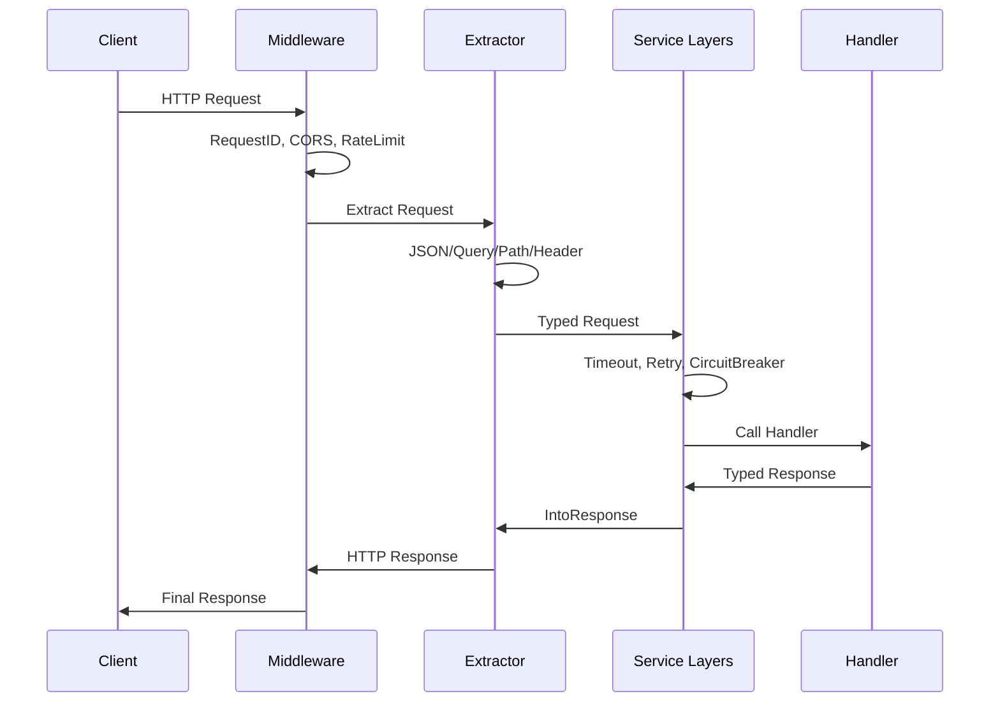

# Core Concepts

## Architecture Overview

Espresso follows a layered architecture inspired by Axum (Rust):

<div class="mermaid-wrapper">



</div>

## The Coffee Metaphor

Espresso uses coffee terminology to make the API intuitive:

| Term | Component | Purpose |
|------|-----------|---------|
| **Portafilter** | `Portafilter()` | Creates the router (holds routes) |
| **Ristretto** | `Ristretto()` | 0-param handler (concentrated) |
| **Solo** | `Solo()` | 1-param handler (single shot) |
| **Doppio** | `Doppio()` | 2-param handler (double shot) |
| **Brew** | `Brew()` | Starts the server |
| **Use** | `Use()` | Adds middleware (grinding beans) |

## Request Flow

<div class="mermaid-wrapper">



</div>

## Handler Types

### Ristretto (0 params)

For simple responses like health checks:

```go
func health() espresso.Text {
    return espresso.Text{Body: "OK"}
}

app.Get("/health", espresso.Ristretto(health))
```

### Solo (1 param)

For handlers that only need request data:

```go
func getUser(req *espresso.JSON[UserReq]) (espresso.JSON[User], error) {
    return espresso.JSON[User]{Data: User{ID: req.Data.ID}}, nil
}

app.Post("/users", espresso.Solo(getUser))
```

### Doppio (2 params)

For production handlers with full control:

```go
func createUser(ctx context.Context, req *espresso.JSON[CreateUserReq]) (espresso.JSON[User], error) {
    // Access context for tracing, auth, etc.
    requestID := espresso.GetRequestID(ctx)
    
    // Access request data
    user := req.Data
    
    return espresso.JSON[User]{
        StatusCode: http.StatusCreated,
        Data:       User{ID: 1, Name: user.Name},
    }, nil
}

app.Post("/users", espresso.Doppio(createUser))
```

## Extractors

Extractors parse request data into typed structs:

```go
// Built-in extractors
type CreateUserReq struct {
    Name  string `json:"name"`              // JSON body
    Email string `json:"email"`
}

type SearchReq struct {
    Query string `query:"q"`     // URL query
    Page  int    `query:"page"`
}

type UserReq struct {
    ID int `path:"id"`           // Path parameter
}
```

### Custom Extractor

```go
type CreateUserReq struct {
    Name  string
    Email string
    Role  string // from query param
}

func (r *CreateUserReq) Extract(req *http.Request) error {
    if err := json.NewDecoder(req.Body).Decode(r); err != nil {
        return err
    }
    r.Role = req.URL.Query().Get("role")
    return nil
}
```

## Middleware

### HTTP-Level Middleware

Runs before extraction, operates on raw HTTP:

```go
app.Use(httpmiddleware.RequestIDMiddleware())
app.Use(httpmiddleware.RecoverMiddleware())
app.Use(httpmiddleware.CORSMiddleware(config))
app.Use(httpmiddleware.RateLimitMiddleware(limiter))
```

### Service Layers

Runs after extraction, operates on typed data:

```go
layers := espresso.Layers(
    espresso.Timeout(5 * time.Second),
    espresso.Logging(logger, "api"),
    espresso.Validation(validator),
)

app.Post("/users", espresso.WithLayers(createUser, layers...))
```

## State Management

Inject dependencies using context:

```go
type AppState struct {
    DB     *sql.DB
    Config Config
}

// Inject state
app := espresso.Portafilter().WithState(AppState{DB: db, Config: config})

// Access in handlers
func handler(ctx context.Context, req *espresso.JSON[Req]) (Res, error) {
    state := espresso.MustGetState[AppState](ctx)
    users := state.DB.FindAllUsers()
    // ...
}
```

## Response Types

### JSON

```go
return espresso.JSON[User]{
    StatusCode: http.StatusCreated,
    Data: User{ID: 1, Name: "John"},
}
```

### Text

```go
return espresso.Text{Body: "OK"}
return espresso.Text{StatusCode: 404, Body: "Not Found"}
```

### Status Only

```go
return espresso.Status(http.StatusNoContent)
```

## Next Steps

- [Routing](/guide/routing) — Route registration patterns
- [Handlers](/guide/handlers) — Detailed handler guide
- [Extractors](/guide/extractors) — All extractor types
- [Middleware](/guide/middleware/) — Middleware composition