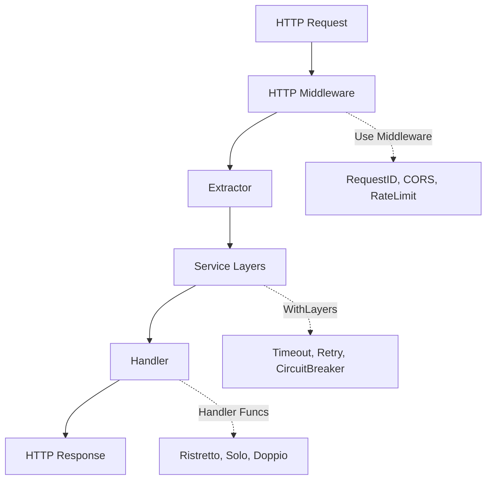

<script setup>
import { VPTeamMembers } from 'vitepress/theme'

const members = [
  {
    avatar: 'https://github.com/suryakencana007.png',
    name: 'Surya Kencana',
    title: 'Creator',
    links: [
      { icon: 'github', link: 'https://github.com/suryakencana007' }
    ]
  }
]
</script>

< VPTeamMembers :members="members" />

## Quick Example

<div class="language-go vp-adaptive-theme">

```go
package main

import (
    "context"
    "net/http"

    "github.com/suryakencana007/espresso"
    "github.com/suryakencana007/espresso/extractor"
    httpmiddleware "github.com/suryakencana007/espresso/middleware/http"
)

type CreateUserReq struct {
    Name  string `json:"name"`
    Email string `json:"email"`
}

type UserRes struct {
    Message string `json:"message"`
}

func main() {
    // Create the router (Portafilter)
    espresso.Portafilter().
        Use(httpmiddleware.RequestIDMiddleware()).
        Use(httpmiddleware.RecoverMiddleware()).
        
        // Simple health check (Ristretto - 0 params)
        Get("/health", espresso.Ristretto(func() espresso.Text {
            return espresso.Text{Body: "OK"}
        })).
        
        // JSON body extraction (Doppio - 2 params)
        Post("/users", espresso.Doppio(createUser)).
        
        // Path parameter extraction
        Get("/users/{id}", espresso.Doppio(getUser)).
        
        // Start the server (Brew)
        Brew(espresso.WithAddr(":8080"))
}

func createUser(ctx context.Context, req *espresso.JSON[CreateUserReq]) (espresso.JSON[UserRes], error) {
    return espresso.JSON[UserRes]{
        StatusCode: http.StatusCreated,
        Data: UserRes{Message: "Created user: " + req.Data.Name},
    }, nil
}

func getUser(ctx context.Context, req *extractor.Path[struct{ ID int `path:"id"` }]) (espresso.JSON[UserRes], error) {
    return espresso.JSON[UserRes]{
        Data: UserRes{Message: "User ID: " + string(rune(req.Data.ID))},
    }, nil
}
```

</div>

## Why Espresso?

### Type-Safe Extractors

Like Axum (Rust), Espresso provides automatic request extraction:

```go
func handler(ctx context.Context, req *espresso.JSON[CreateUserReq]) (espresso.JSON[User], error) {
    user := req.Data  // Automatically decoded JSON
    // ...
}
```

### Zero-Allocation Handlers

Uses sync.Pool for request objects — no allocations per request.

## Architecture

<div class="mermaid-wrapper">



</div>

## Performance

| Component | Allocation | Pool |
|-----------|-------------|------|
| `Doppio` | Zero alloc/request | sync.Pool |
| `Solo` | Zero alloc/request | sync.Pool |
| `Ristretto` | Zero | None needed |
| `BufferPool` | ~25 ns/op | sync.Pool |

## Test Coverage

| Package | Coverage |
|---------|----------|
| espresso (root) | 76.9% |
| extractor | 91.1% |
| middleware/http | 93.0% |
| middleware/service | 78.3% |
| pool | 90.0% |

## Sponsors

If you find Espresso useful, please consider [sponsoring](https://github.com/sponsors/suryakencana007) the project.

## License

[MIT License](https://github.com/suryakencana007/espresso/blob/main/LICENSE)